# Documentation set at Bluewind for aws-NXP project

This repository contains documentation about the aws-NXP project developed at Bluewind.
Documents are prepared using Markdown files.

### Language

Documentation language is English (for written matter).

### Amazon Services

By the end of this tutorial you will be able to drive an **NXP OM40007|LPC54018 IoT Module**
by means of Amazon Developer Services.  

We are going to set everything up to operate the following workflow:

 - The user speaks to the **Echo** device to activate an **Alexa skill**;
 - The Alexa Skill triggers an **AWS-Lambda** function which sends a message to the **AWS-IoT**;
 - The **NXP IoT Module** is registered on the AWS-IoT and receives the message to perform the targeted action (turn on/off LED or read temperature);
 - The NXP Module sends a feedback message to the AWS-IoT platform; 
 - AWS-Lambda retrieves the feedback message and sends it back to the Alexa platform;
 - This makes the Echo device respond to user: *"The LED is on/off !"* or *"The actual temperature is x degrees "*.

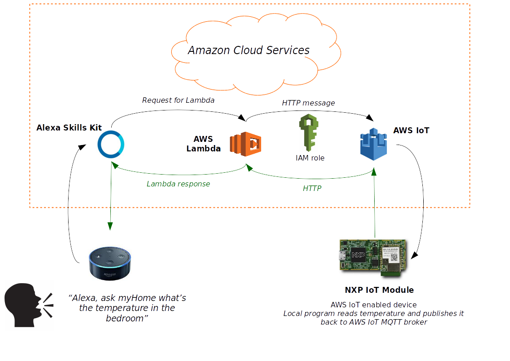

As you noticed there are three Amazon services involved in the workflow: AWS-IoT, AWS-Lambda and the Amazon Alexa Service.  
The latter belongs to the Amazon Developer Services, while the others are two of the many Amazon Web Services available at AWS.  
Ops there's a fourth as well: it's AWS IAM (Identity and Access Management) which helps us manage our accounts and services accessibility.  

This tutorial covers the **cloud infrastructure** configuration and deployment. You want to setup the **NXP module** as well by reading the complementary README you can find in the NXP subfolder in git repo.  

### Requirements

You will need an *NXP IoT module* and an *Amazon Echo*:

 - NXP OM40007|LPC54018 IoT Module (https://www.nxp.com/support/developer-resources/reference-designs/lpc54018-iot-solution-with-amazon-freertos:IoT-Solution-with-Amazon-FreeRTOS)
 - Any version of the Amazon Echo device

If Echo is not shipped to your Country you might use one of the browser emulators you can find on the internet (for example: https://alexaweb.herokuapp.com/).  

You will also need to register and create a free user tier account at the following Amazon services to access the AWS resources and the Alexa service:

 - one account at Amazon Developer Services (https://developer.amazon.com/)
 - one account at Amazon Web Services - AWS (https://aws.amazon.com/)

During registration you will be asked for your credit card credentials: all the actions performed in this tutorial won't charge your account, each resource is accessible for free, as we're using the AWS free usage tier.  
You can find more information about AWS costs at the following link: https://aws.amazon.com/getting-started/.  
Now that you have the Amazon developer and the AWS accounts go ahead with the tutorial and configure the cloud services and the NXP IoT Module.  

### Create an IAM user

You should now have an *AWS account root user* to access AWS. It's highly recommended to access AWS with your root user credentials the first time to create an **IAM user**, and then accessing AWS using your IAM user credentials.  
Here is how to do it using **AWS-IAM**.  

Enter the Amazon AWS management console (top right of https://aws.amazon.com/) with your root user credentials (Amazon AWS Services credentials).  
Look for *All Services* -> *Security, Identity & Compliance* -> *IAM* and click on it.  

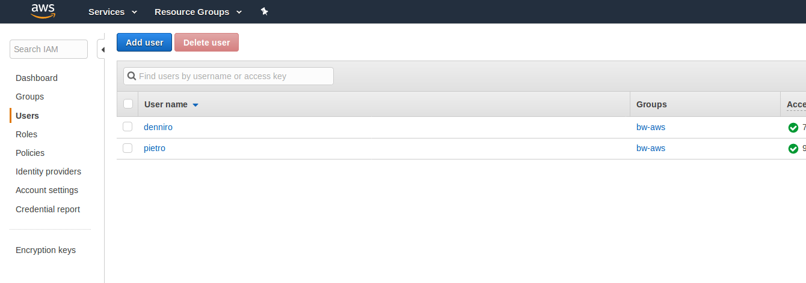

In the left-side menu select *Users* and then click on "*Add user*". Edit the *User name* field (for example *YourName*) and select both the *Programmatic access* and *AWS Management Console access*.  
Choose the password settings you prefer and then click on "*Next: Permissions*".  
Select "*Attach existing policies directly*" and flag the "*AdministratorAccess*" under policy name. Click on "*Next: Review*" and then on "*Create user*".  
You will then find the link to accessing AWS with your new IAM credentials. Also download and save locally the *.csv* file: it contains your IAM user security credentials which you might need in the future.
(Access keys are not used in this tutorials but you might need them in the future: access keys are used to make programmatic calls to AWS from the AWS APIs, AWS CLI, AWS SDKs, or AWS Tools for Windows PowerShell).  

As a last step in creating the IAM user click on "*Close*". You've just created a new IAM user account: logout AWS and then log in again using your new IAM user credentials.

Great, now let's move on and configure the other cloud services.

### Create an AWS Lambda Function

In this section we are going to set up the Lambda function; do you remember the picture above? The Lambda function is linked to the Alexa Skill kit at one side and to AWS IoT at the other.  
Thanks to Lambda functions we can receive inputs from Alexa and perform action over the AWS IoT, and viceversa.  
To communicate with AWS IoT we will need to provide Lambda with an IAM key to guarantee accessibility.  
Follow the steps below to create and configure the Lambda function.  

Enter the Amazon AWS management console with your IAM user credentials and select the **US East (N. Virginia)** region on the top right.  
Alexa is available at this region and that's why we're choosing it.  
All other amazon resources will be redirected to interact with this lambda function stored at *US East (N. Virginia)*: they won't be able to interact with resources based at different regions!  

Then look for *All Services* -> *Compute* -> *Lambda* and click on it.  

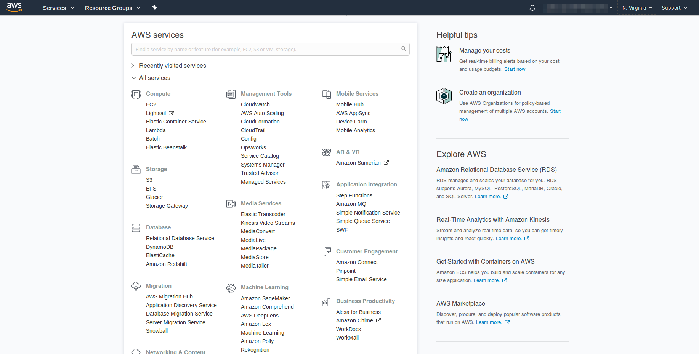

After accessing the AWS-Lambda you will find an orange button on the right that allows you to create a new function.  
If you click on it you will be able to start your own Lambda Function.  

Select the "*Author from Scratch*" option (if not set by default) and edit the *Name* you wish to assign to the Lambda Function (for example *NXPModuleManager*).
Then select Python 3.6 in the "*Runtime*" drop-down menu since we are going to use Python 3 written code.
Open the "*Role*" drop-down menu. Select "*Create a custom role*". A new page will pop-up.  
Under "*IAM role*" type "*lambda_basic_execution*" (this is just an arbitrary name).  
Finally click on "*Allow*" at the bottom right.  

You should be returned to the previous page: select "*Choose an existing role*" from the "*Role*" drop-down menu.  
Then select the created role (*lambda_basic_execution*) from the "*Existing Role*" drop-down menu.  

Great! You created the role to be assigned to the Lambda function. But...what's a *Role*?  
As stated at Amazon AWS Documentation (https://docs.aws.amazon.com/IAM/latest/UserGuide/id_roles.html) a *Role* is a set of policies that determine what the user or identity using that Role can/cannot do within AWS.  
We will get back to this in a while, to attach new policies to the role and allow Lambda function to access other AWS platforms.  
You can now create the function by clicking on "*Create Function*" at the bottom right.  

On the top right you can see the ARN (Amazon Resource Number) of the Lambda Function you've just created.
That's the ARN that will allow us to link this function to the Alexa service: we'll get back to this later.  

To configure the Lambda function you need on step more: scroll down and you will find the editable function code window. There's some preconfigured code which you want to erase.  
Copy-paste our *lambda_funcion.py* code (find it in git repo - AWS subfolder) and then click on "*Save*" at top right.  
Well done: you've just created and configured the AWS Lambda function.  

Before going on change the timeout settings of the lambda function (scroll down and find the dedicated section): raise it up to 10 sec, that's enough to allow your lambda function to interact with the other
cloud platforms without early stopping.  

What to do now? We want to give Lambda the permission to access AWS IoT service.  
This is an easy task too:  
access *AWS management console* -> *IAM management* console and browse to "*Roles*" on the left-side menu.  
You should find here your *lambda_basic_execution* role that was created before.  
Select it and then click on "*Attach policy*". Find and flag the *AWSIoTFullAccess* policy and then click on "*Attach policy*".  
Our Lambda function will now on have the authorization to access and interact with AWS IoT.  

### Create an Alexa skill and link it to the AWS Lambda function

In this section we are going to set an Alexa Skill, but what's a skill? It's a set of expressions and utterances which we want Alexa to be able to recognize.
By setting a new skill, we will be able to interact with Alexa and trigger our Lambda function by saying those specific expressions to our Echo device.
Follow the steps below to create and configure a new Alexa skill.

Enter the Amazon developer console (https://developer.amazon.com/) in a new browser window with your credentials for the Amazon Developer Services and enter the Alexa tab (top bar menu).
You will now see five available resources:
 - amazon alexa
 - amazon appstore
 - amazon web services
 - desktop apps & games
 - dash services

Choose amazon alexa.

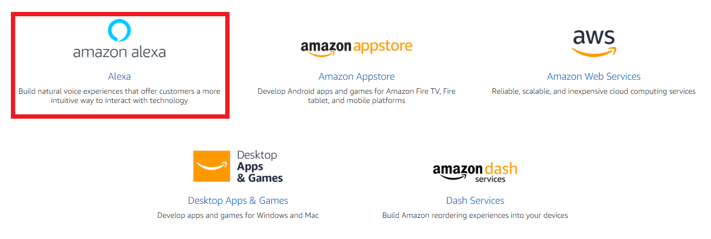

Click on Alexa Skills Kit --> Get Started --> Alexa Skill Kit

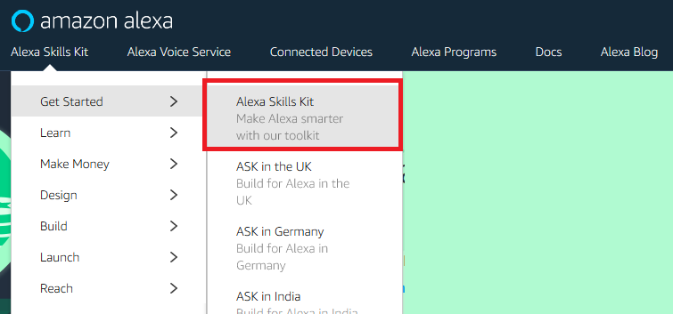

To build a new interacting skill in our Alexa Service click **Start a Skill**.On the top right click on "**Create Skill**" to create a new skill.
Here is where we are going to configure our Alexa services to interact with the AWS-Lambda Function.

Set a name to your Skill, for example, "**LED and temperature**" then click **Next**

Select the **Custom** model to add to your skill, then click on **Create Skill**

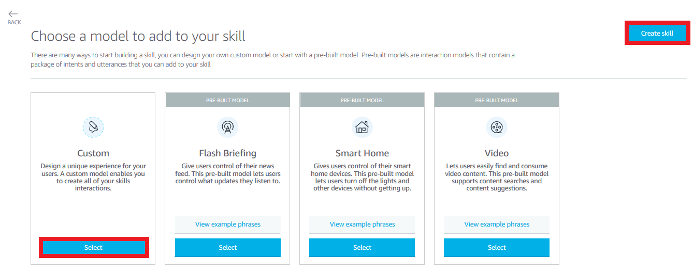

We are now in the "**Interaction Model**" section. On the right panel, you will see a checklist we need to go through to create our Alexa Skill: *Invocation Name*, *Intents, Samples, and Slots*, *Build Model*, ...

At the left side menu, select Invocation. Enter your skill Invocation's Name (for example, "*my home*"). The *Invocation Name* is the name we need to invoke to activate this particular skill we're creating.
So if we want to activate the "*LED and temperature*" skill when interacting with our Echo device we will have to say "*Alexa, ask my home to blablabla...*".
In the future, if you don't remember the invocation name or if you want to change it you can navigate to the Alexa Skill Kit on your Developer portal and check it out again.

This way we will be able to choose the NXP IoT Module we want to select and make it perform some particular action we want it to show.

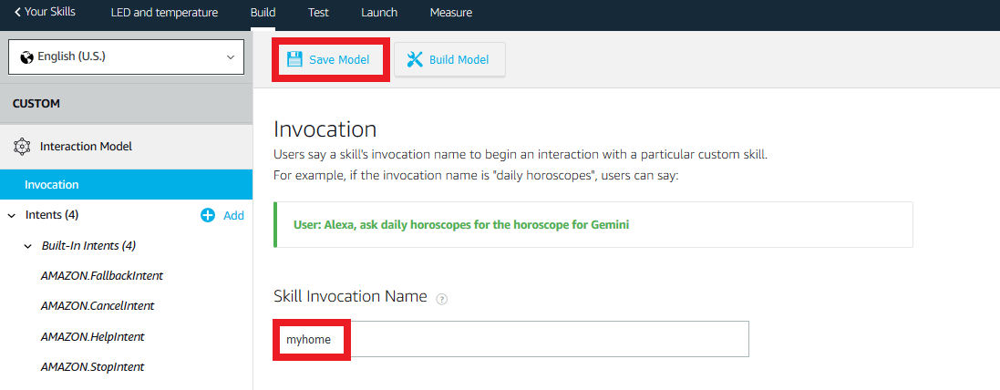

Click on the **JSON Editor** located at the left menu. Then delete the default JSON data and copy-paste the content of **AlexaSkill.json** file.
The JSON file is the translation of what you can manually add using the user-interface menu on the left.
Notice that there is now a **LEDIntent** on your Intent’s list, and the invocation name is set to “myhome”. You can manually add or delete Intents for your application using the Graphical Interface or write it on the JSON Editor.

In this JSON we list the intents we will be able to call by saying some predefined expressions **Sample Utterances**.
The intents starting with *AMAZON...* are default intents for the Alexa Skill, which allow the Alexa Service to perform default actions (like stopping, entering the user help or others..).
The intent we are creating here is the "**LEDIntent**" which represents the name of the request that our Alexa Skill will send to the Lambda Function when we want to turn on/off the LED of the NXP IoT Module.
The "*TempIntent*" is the name of the request that the Alexa Skill will send to the Lambda Function when we want to know which is the temperature measured by the NXP IoT Module.
Navigate to the LEDIntent section and verify the different Utterances your Alexa will be able to recognize to manipulate the LED. Finally, click **Build Model**

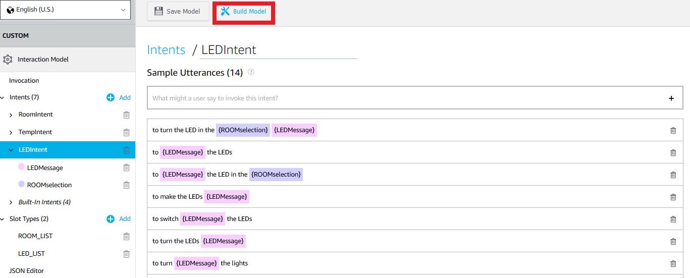

Click **Endpoint** select AWS Lambda ARN (Amazon Resource Name) since we want our Alexa Skill to trigger a Lambda Function.
Ane editable line will appear: that's where we need to paste the ARN of the Lambda Function we want to link.
So navigate to AWS Lambda and access the *NXPModuleManager* function we created before (you should have the window opened still since back).
Find the ARN of the NXPModuleManager on the top right and copy it to your notes (the ARN will be something like "arn:aws:lambda:us-east[.....]NXPModuleManager").
Then move back to the Alexa Skill Kit and paste it into the editable line.

Before going to edit the next section, we need to provide our Lambda Function the Alexa Application ID to which it is going to be linked.
So, scroll up with your mouse and find the Alexa Skill ID (something like "amzn1.ask.skill[....]", right under the Skill name, below the top Menu).
Copy the ID and move to the AWS Lambda console (https://aws.amazon.com/lambda/) and select the NXPModuleManager function.
On the left, you will see the *Add Triggers* menu: select *Alexa Skill Kit* to add a trigger.
Below you can configure the trigger settings:
 - Enable the Skill ID verification
 - Paste the Skill ID previously copied under the *Skill ID*

Finally, click on "*Add*" at the bottom right and then save the Lambda function ("*Save*" orange button at the top right).

Move back to the Alexa Skill Kit console again and:
 - Click on **Save Endpoints** at the top left
 - Click on CUSTOM to verify that all the Skill builder checklist complete successfully

### Create a thing on AWS IoT

In this section we are going to register our NXP IoT modules to the **AWS IoT** so that they can interact with the other Amazon Services we've created.  
Navigate to *AWS Management Console* -> *All Services* -> *Internet of Things* -> *AWS IoT* and access using your IAM user credentials.  
If this is your first time in AWS IoT you can take a look at the *Get Started* tutorials, or you can skip for now and get back to them later.  
Select "*Manage*" on the left-side menu and then "*Things*" on the sub-menu.  
If this is the first time access you should click "*Register a Thing*". Otherwise click on "*Create*" at the top right of the screen.  

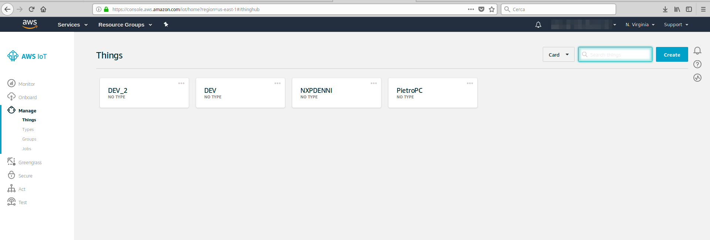

Select then "*Create a single thing*" and edit the thing's *Name* to "*KitchenThing*".  
You might as well choose a different name but then remember to edit the *lambda_function.py* code in your AWS lambda function: the names of your NXP modules are set at lines 7 and 8 of the *lambda_function.py*.  
Skip the *Apply a type to this thing* and *Add this thing to a group* as well as the *Set searchable thing attributes (optional)* sections and scroll down untill you find *Show thing shadow*.  
Before going on to the next page take a look at the **thing's shadow** in the "*Show thing shadow*". The shadow enable communication and interaction with the real device through AWS-IoT.
It is set as a JSON format text and it represents the image of your real device in the Amazon Cloud.  
Copy the json from *shadow_init.json* (find it in git) and paste it in the editable shadow's window as initialization.  
Click on "*Next*".  

In the "*Add a certificate for your thing*" page select the recommended way to establish authorization for your device to communicate with the AWS-IoT by choosing the *One-click certificate creation (recommended)* option.  
Click on "*Create certificate*".

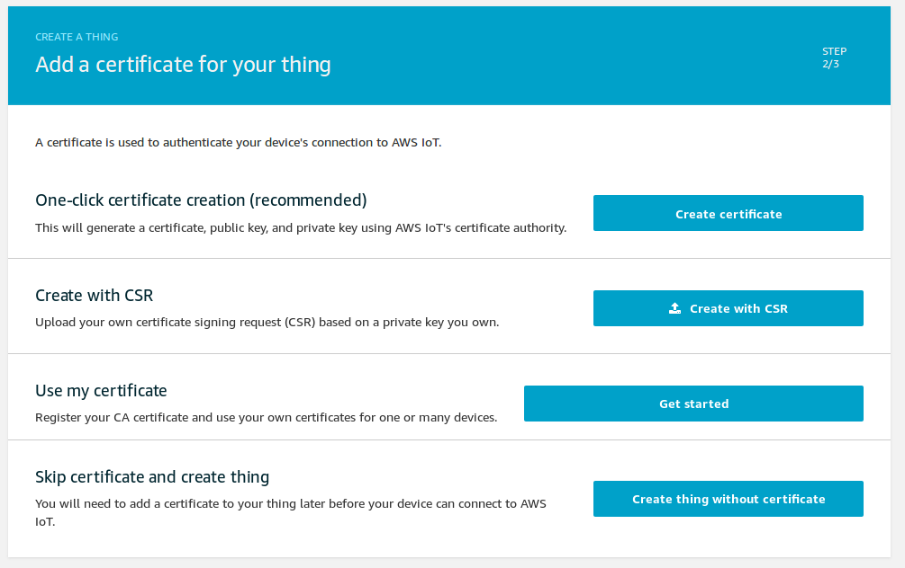

In the next page download all you need to guarantee accessibility to the AWS-IoT: save the **.cert.pem** as well as the **public** and **private keys** and the **rootCA** in a local directory.
You will need them when programming the NXP modules (you will find all instructions on how to program your NXP modules in the README at NXP subfolder of git repo).  

Select "*Activate*" and then "*Attach a policy*".
We don't have a policy yet so click on "*Done*" (or "*Register thing*" if this is your first time access).  
Then, navigate to *Secure* -> *Policies* on the left-side menu. Click on "*Create*" on the top right and edit the policy name (for example type "*NXPModulePolicy*").  
In the *Add Statements* -> *Action* type "_iot:*_". In the *Resource ARN* field replace the "*replaceWithATopic*" field with "*NXP*". You should have something like: "*arn:aws:iot:us-east-1:306*********:topic/replaceWithATopic*" which 
you want to turn into "*arn:aws:iot:us-east-1:306*********:topic/NXP*".  
Select the *Allow* Effect and then click on "*Create*".  

Go back to the certificates and select the certificate you created by clicking on its icon.  
After you entered the certificate go to *Policies* and select "*Actions* -> "*Attach policy*" at the top right. Select the policy you created and click "*Attach*".  

You've just created a thing in AWS IoT. You now have the keys to access and interact with the Amazon services with your NXP IoT Module.  
Repeat the procedure to register a second device and call it "*BedroomThing*" or choose a different name and edit it at line 8 of the lambda function code.

### Testing your Skill

Well done! You set up each service you need to drive the NXP Module and you're ready to run the first test speaking to Echo.

Enter the **Alexa App** with your Amazon Developer credentials (https://alexa.amazon.com).  
Then go to "*Skills*" from the left-side menu and click on "*Your Skills*" on the top right.  
Select "*DEV SKILLS*" and you should find the "*LED and temperature*" skill you created before.  

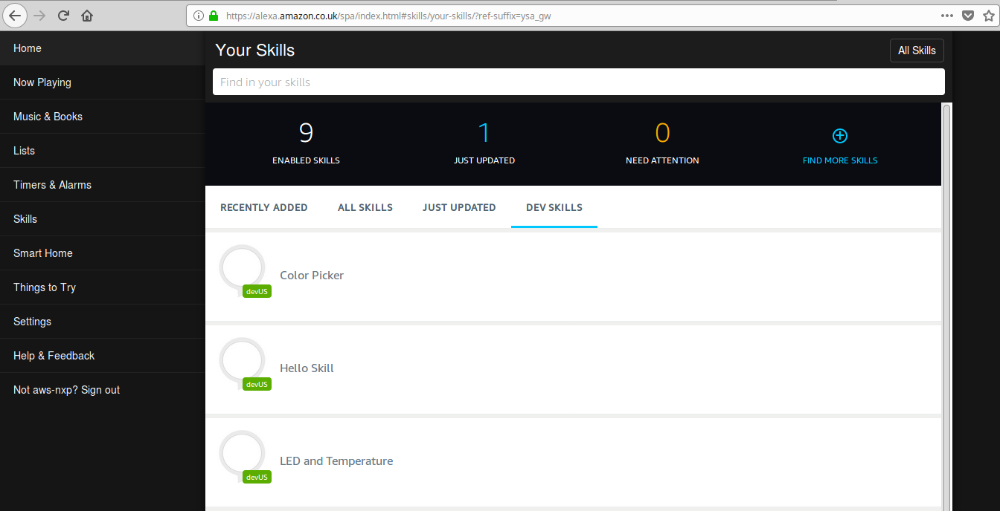

If you don't have an Echo device you can run your test using a browser emulator (https://alexaweb.herokuapp.com/).  

If you have an Echo then you can configure it in the Alexa App.  
Go to *Settings* from the left-side menu.  
Under *Devices* click on "*Set up a new device*" and follow the instructions, it's just a few simple steps.  

To test everything is running ask your Echo device (or browser emulator) to turn on the LED by saying: "*Alexa, ask myHome to turn on the LED*".  

Alexa should recognize you're asking to access the *LED and Temperature* function in AWS Lambda and will reply by saying: "*Do you mean in the kitchen? or in the bedroom? or both?*".  
Before interacting further we need to set up the NXP Modules.  
Follow the instructions at the README in the NXP subfolder of the git repo to set up the NXP modules.

 