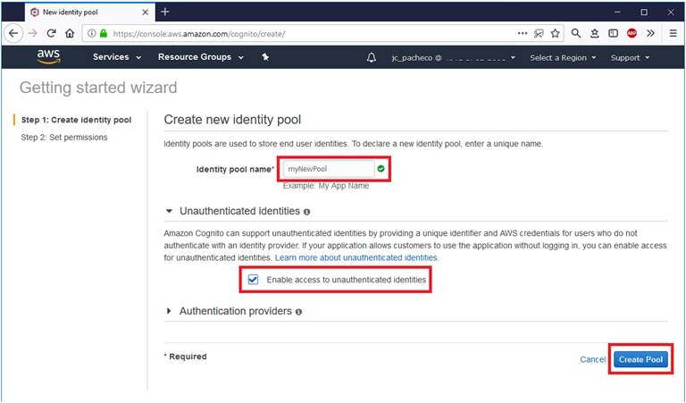
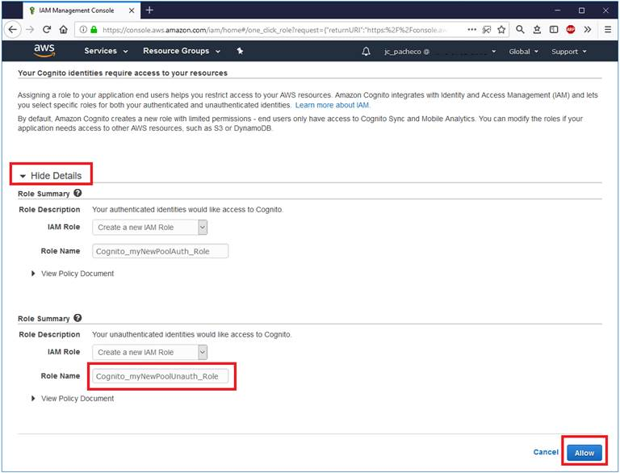
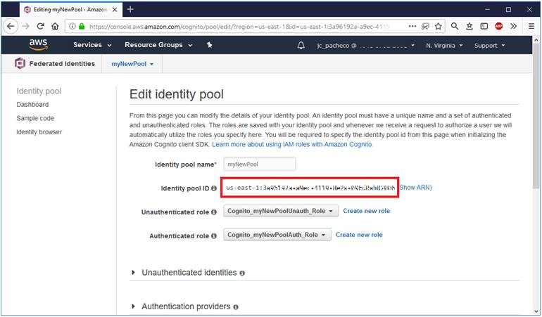
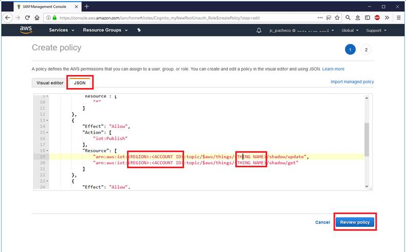
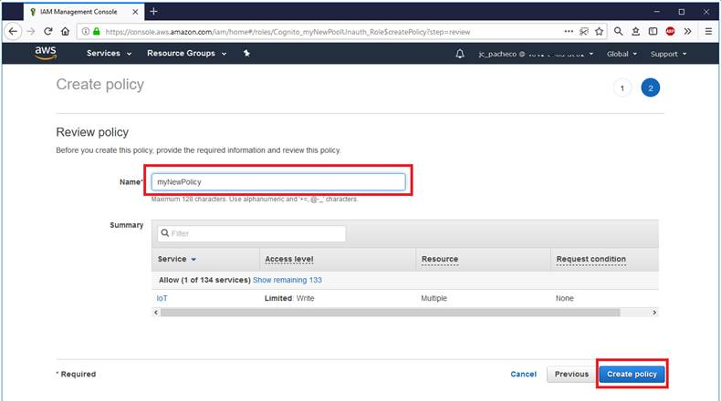
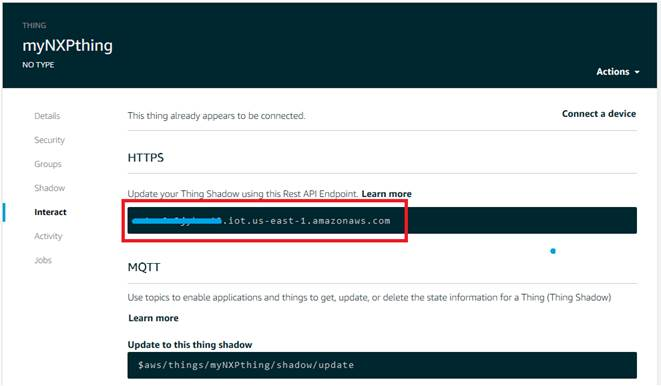
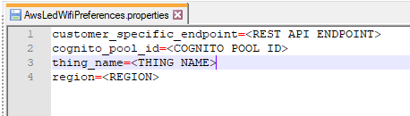
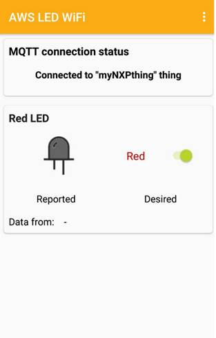

Prepare the Demo
================
Before running the demo it is need to configure AWS IoT Console and update some of project files:

1.  Import the NXP [SDK SDK_2.3.0_LPC54018-IoT-Module from here](https://mcuxpresso.nxp.com/en/welcome) into the MCUXpresso IDE, follow the [getting started guide here](https://www.nxp.com/docs/en/user-guide/MCUXSDKGSUG.pdf).

2.  Create AWS Account [navigating here](https://console.aws.amazon.com/console/home)

3.  Configure Amazon AWS services following the recipe contained [in this README](../AWS/README.md), you will need
    to switch to the related folder and come back here at the end

4.  Configure device in the AWS IoT Console base [on this guide](https://docs.aws.amazon.com/iot/latest/developerguide/iot-sdk-setup.html)

    Make note of example's "Thing name" and "REST API endpoint". These strings need to be set in the `aws_clientcredential.h`.

	Example:
	```
		static const char clientcredentialMQTT_BROKER_ENDPOINT[] = "abcdefgh123456.iot.us-west-2.amazonaws.com";
		#define clientcredentialIOT_THING_NAME "MyExample"
	```

    In the next step you will get the "device certificate" and the "primary key". Each of the certificates needs to be opened in text editor and its content copied into the "aws_clientcredential_keys.h".
    Or you can use the `CertificateConfigurator.html` (`mcu-sdk-2.0\rtos\amazon-freertos\demos\common\devmode_key_provisioning\CertificateConfigurationTool`) to generate the `aws_clientcredential_keys.h`.

    Example:
    ```
        static const char clientcredentialCLIENT_CERTIFICATE_PEM[] = "";
    ```
    Needs to be changed to:

    ```
        static const char clientcredentialCLIENT_CERTIFICATE_PEM[] =
            "-----BEGIN CERTIFICATE-----\n"
            "MIIDWTCCAkGgAwIBAgIUPwbiJBIJhO6eF498l1GZ8siO/K0wDQYJKoZIhvcNAQEL\n"
            .
            .
            "KByzyTutxTeI9UKcIPFxK40s4qF50a40/6UFxrGueW+TzZ4iubWzP7eG+47r\n"
            "-----END CERTIFICATE-----\n";
    ```
    
    In the same way please update the private key array.

5.  This demo needs WiFi network with internet access.

	If this is the first time is possible to program this define (flash must be at the default value), otherwise you must use shell command described in point 11.

    Update these macros in `aws_clientcredential.h` based on your WiFi network configuration:

    ```
        #define clientcredentialWIFI_SSID       "Paste WiFi SSID here."
        #define clientcredentialWIFI_PASSWORD   "Paste WiFi password here."
    ```

6.  Open example's project and build it.

7.  Connect a USB cable between the PC host and the J8 port on the target board.

8.  Download the program to the target board with a J-Link debugger or a LPC-LINK 2.

9.  Either press the reset button on your board or launch the debugger in your IDE to begin running the demo.

10.  Follow `amazon-freertos/lib/third_party/mcu_vendor/nxp/LPC54018/utilities/virtual_com_readme.pdf` guide to install Virtual_COM driver.

	Open a serial terminal on PC for serial device with these settings:
    - 115200 baud rate
    - 8 data bits
    - No parity
    - One stop bit
    - No flow control
	
11. Use the shell of the serial terminal to config the WIFI parameters, list of all command here:
	- "help": Lists all the registered commands
	- "exit": Exit program
	- "led arg1 arg2": Power on/off a LED without MQTT message (OM400007 LED on board = LED 3)
	  Usage:
		arg1: 1|2|3|4...            Led index
		arg2: on|off                Led status
	- "ssid arg1": Change the WIFI SSID
	  Usage:
		arg1: ssid
	- "password arg1": Change the WIFI PASSWORD
	  Usage:
		arg1: password
	- "security arg1": Change the WIFI SECURITY
	  Usage:
		arg1: 0-eWiFiSecurityOpen 1-eWiFiSecurityWPE 2-eWiFiSecurityWPA 3-eWiFiSecurityWPA2
	- "readwifi" Read the WIFI parameters
	- "writewifi" Write the WIFI parameters in Flash, after every writewifi commands the board needs a HW reset for update the application parameters.

Prepare the Android application
===============================

COGNITO

Cognito configuration will allow your Android application to communicate with your thing. Steps are described in the project under ../doc/readme.txt.

Prepare the Android application

The Android application requires Cognito service to authorize to AWS IoT in order to access device shadows. Use Amazon Cognito to create a new identity pool:

1.  In the Amazon Cognito Console https://console.aws.amazon.com/cognito/ select "Manage Federated Identities" and "Create new identity pool".

2.  Ensure Enable access to unauthenticated identities is checked. This allows the sample application to assume the unauthenticated role associated with this identity pool.

    Note: to keep this example simple it makes use of unauthenticated users in the identity pool. This can be used for getting started and prototypes but unauthenticated users should typically only be given read-only permissions in production applications. More information on Cognito identity pools including the Cognito developer guide can be found here: http://aws.amazon.com/cognito/.




3.  To obtain the Pool ID constant, select "Edit identity pool" and copy Identity pool ID (it will look like <REGION>:<ID>). This Identity pool ID (<COGNITO POOL ID>) will be used in the application (policy and configuration file).



4.  To obtain Account ID, select account name in webpage menu bar and select "My account" from drop down menu. Make note of "Account ID" under "Account Settings".

5. As part of creating the identity pool Cognito will setup two roles in Identity and Access Management (IAM) https://console.aws.amazon.com/iam/home#roles . These will be named something similar to: "Cognito_PoolNameAuth_Role" and "Cognito_PoolNameUnauth_Role".
Create policy to be attached into "Cognito_PoolNameUnauth_Role" though "Policies" menu, selecting "Create policy", "Create Your Own Policy" and copying example policy below into "Policy Document" field and naming it for example "<THING NAME>Policy". Replace <REGION>, <ACCOUNT ID> and <THING NAME> with your respective values. This policy allows the application to get and update the two thing shadows used in this sample.

    {
        "Version": "2012-10-17",
        "Statement": [
            {
                "Effect": "Allow",
                "Action": [
                    "iot:Connect"
                ],
                "Resource": [
                    "*"
                ]
            },
            {
                "Effect": "Allow",
                "Action": [
                    "iot:Publish"
                ],
                "Resource": [
                    "arn:aws:iot:<REGION>:<ACCOUNT ID>:topic/$aws/things/<THING NAME>/shadow/update",
                    "arn:aws:iot:<REGION>:<ACCOUNT ID>:topic/$aws/things/<THING NAME>/shadow/get"
                ]
            },
            {
                "Effect": "Allow",
                "Action": [
                    "iot:Subscribe",
                    "iot:Receive"
                ],
                "Resource": [
                    "*"
                ]
            }
        ]
    }

(select unauth Role)



(add policy... this can be done through Policies -> Create policy  or  directly adding an Inline Policy as shown below)



(configure policy)

 

(set a name to the policy)



6.  Newly created policy now needs to be attached to the unauthenticated role which has permissions to access the required AWS IoT APIs by opening "Cognito_PoolNameUnauth_Role" under "Roles" menu. Then in "Permissions" tab select "Attach policy" to view list of all AWS policies where example's policy "<THING NAME>Policy" needs to be selected though checking its checkbox and clicking on "Attach policy" button.

(step not required if policy was added as inline policy)

    More information on AWS IAM roles and policies can be found here: http://docs.aws.amazon.com/IAM/latest/UserGuide/access_policies_manage.html

    More information on AWS IoT policies can be found here: http://docs.aws.amazon.com/iot/latest/developerguide/authorization.html

Locate the AwsLedWifi.apk and AwsLedWifiPreferences.properties files in the SDK from MCUXpresso:

...\SDK_2.3.0_LPC54018\boards\lpc54018iotmodule\aws_examples\led_wifi_android

7. Prepare "AwsLedWifiPreferences.properties" file with yours AWS credentials. It's structure looks like this:

    customer_specific_endpoint=<REST API ENDPOINT>

    cognito_pool_id=<COGNITO POOL ID>

    thing_name=<THING NAME>

    region=<REGION>



Fill AwsLedWifiPreferences.properties with your thing & account information


Locate the REST API Endpoint of your thing under Thing -> Interact

Then move properties file into your Android device (application will ask for properties file though file browser dialog during first run).

- Connect your Android device to your PC and select to support "File Transfer" instead of just charging, this is done in the android device.

  - Drag & drop AwsLedWifiPreferences.properties to a known folder.

  - Drag & drop AwsLedWifi.apk to a known location

8. To run Android application do either:

    a) install and run pre-build apk on Android device (<SDK_Repository>\<board_name>\src\aws_examples\led_wifi_android\AwsLedWifi.apk)

    Use a File manager application, browse in your Android device to the location where you dropped the AwsLedWifi.apk file and install it

    b) open project in Android Studio, build it, attach Android device and Run application

    Application requires at least Android version 5.1 (Android SDK 22).

    In any case, when asked, select AwsLedWifiPreferences.properties file with AWS IoT preferences. Then application will establish MQTT connection to AWS server, download last state of thing's shadow and will be ready for user input.

When you run the application for the first time, it will ask for a properties file... browse to the dropped file (AwsLedWifiPreferences.properties) and select it.



Running the demo
================
This is the configuration for the board OM40007|LPC54018. Also the aws-nxp readme.md, amazon project for configuration of amazon services tool must be completed before trying the Alexa echo dot demo.

The log below shows the output of the demo in the terminal window. The log can be different based on your WiFi network configuration and based on the actions, which you have done in the Android application.

Android application displays status of the LED which are split into Desired and Reported section. Desired value is value wanted by user and Reported value is actual state of the LED on device.

- When you turn on/off the LED in the Android application, the change should be visible on the LED on the board.

Every mentioned action takes approximately 1-3 seconds.

~~~~~~~~~~~~~~~~~~~~~~~~~~~~~~~~~~~
0 0 [Tmr Svc] Starting key provisioning...
1 0 [Tmr Svc] Write root certificate...
2 0 [Tmr Svc] Write device private key...
3 10 [Tmr Svc] Write device certificate...
4 19 [Tmr Svc] Key provisioning done...
5 19 [Tmr Svc] Starting WiFi...
6 1271 [Tmr Svc] WiFi module initialized.
9 2334 [AWS-MAIN] WiFi connected to AP AndroidAP.
10 2338 [AWS-MAIN] Attempt to Get IP.
11 7090 [AWS-MAIN] IP Address acquired 192.168.0.51
12 7097 [AWS-LED] [Shadow 0] MQTT: Creation of dedicated MQTT client succeeded.
13 7103 [AWS-LED] Sending command to MQTT task.
14 7109 [MQTT] Received message 10000 from queue.
15 7286 [MQTT] Looked up a7sw0r7rvpirn.iot.us-east-1.amazonaws.com as 52.1.125.230
16 29348 [MQTT] MQTT Connect was accepted. Connection established.
17 29349 [MQTT] Notifying task.
18 29354 [AWS-LED] Command sent to MQTT task passed.
19 29357 [AWS-LED] [Shadow 0] MQTT: Connect succeeded.
20 29361 [AWS-LED] Sending command to MQTT task.
21 29367 [MQTT] Received message 20000 from queue.
22 29701 [MQTT] MQTT Subscribe was accepted. Subscribed.
23 29702 [MQTT] Notifying task.
24 29707 [AWS-LED] Command sent to MQTT task passed.
25 29710 [AWS-LED] [Shadow 0] MQTT: Subscribe to callback topic succeeded.
26 29714 [AWS-LED] Sending command to MQTT task.
27 29720 [MQTT] Received message 30000 from queue.
28 29954 [MQTT] MQTT Subscribe was accepted. Subscribed.
29 29955 [MQTT] Notifying task.
30 29960 [AWS-LED] Command sent to MQTT task passed.
31 29963 [AWS-LED] [Shadow 0] MQTT: Subscribe to accepted topic succeeded.
32 29967 [AWS-LED] Sending command to MQTT task.
33 29971 [MQTT] Received message 40000 from queue.
34 30206 [MQTT] MQTT Subscribe was accepted. Subscribed.
35 30207 [MQTT] Notifying task.
36 30212 [AWS-LED] Command sent to MQTT task passed.
37 30215 [AWS-LED] [Shadow 0] MQTT: Subscribe to rejected topic succeeded.
38 30219 [AWS-LED] Sending command to MQTT task.
39 30225 [MQTT] Received message 50000 from queue.
40 30248 [MQTT] Notifying task.
41 30253 [AWS-LED] Command sent to MQTT task passed.
42 30256 [AWS-LED] [Shadow 0] MQTT: Publish to operation topic succeeded.
43 30489 [AWS-LED] Sending command to MQTT task.
44 30495 [MQTT] Received message 60000 from queue.
45 30729 [MQTT] MQTT Subscribe was accepted. Subscribed.
46 30730 [MQTT] Notifying task.
47 30735 [AWS-LED] Command sent to MQTT task passed.
48 30738 [AWS-LED] [Shadow 0] MQTT: Subscribe to accepted topic succeeded.
49 30742 [AWS-LED] Sending command to MQTT task.
50 30746 [MQTT] Received message 70000 from queue.
51 30981 [MQTT] MQTT Subscribe was accepted. Subscribed.
52 30982 [MQTT] Notifying task.
53 30987 [AWS-LED] Command sent to MQTT task passed.
54 30990 [AWS-LED] [Shadow 0] MQTT: Subscribe to rejected topic succeeded.
55 30994 [AWS-LED] Sending command to MQTT task.
56 31000 [MQTT] Received message 80000 from queue.
57 31031 [MQTT] Notifying task.
58 31037 [AWS-LED] Command sent to MQTT task passed.
59 31040 [AWS-LED] [Shadow 0] MQTT: Publish to operation topic succeeded.
60 31297 [AWS-LED] AWS LED Demo initialized.
61 31300 [AWS-LED] Use mobile application to turn on/off the LED.
62 41334 [AWS-LED] TempValue        = 17.1
63 41340 [AWS-LED] Sending command to MQTT task.
64 41346 [MQTT] Received message 90000 from queue.
65 41371 [MQTT] Notifying task.
66 41377 [AWS-LED] Command sent to MQTT task passed.
67 41380 [AWS-LED] [Shadow 0] MQTT: Publish to operation topic succeeded.
68 41663 [AWS-LED] [Shadow 0] MQTT: Return MQTT buffer succeeded.
69 51700 [AWS-LED] TempValue        = 17.42
70 51706 [AWS-LED] Sending command to MQTT task.
71 51712 [MQTT] Received message a0000 from queue.
72 51737 [MQTT] Notifying task.
73 51743 [AWS-LED] Command sent to MQTT task passed.
74 51746 [AWS-LED] [Shadow 0] MQTT: Publish to operation topic succeeded.
75 52030 [AWS-LED] [Shadow 0] MQTT: Return MQTT buffer succeeded.
76 55990 [MQTT] [Shadow 0] Warning: got an MQTT disconnect message.
77 55991 [MQTT] About to close socket.
78 56032 [MQTT] Socket closed.

